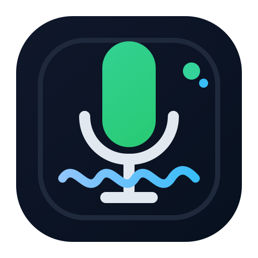

# VoiceBox ASR

<p align="center">
  
</p>

一个独立安装的本地离线语音转写服务。Rust sidecar 自带测试页，模型默认从 `models/` 目录加载。

## 运行服务

模型目录保持这个结构：

```text
models/
  paraformer-zh-small-2024-03-09/
    model.int8.onnx
    tokens.txt
  punct-ct-transformer-zh-en-vocab272727-2024-04-12-int8/
    model.int8.onnx
```

启动：

```bash
cargo run
```

打开：

```text
http://127.0.0.1:8765/
```

## 接口

服务默认地址：

```text
http://127.0.0.1:8765
```

当前模型只支持中文，转写时用 `language=zh`。
当前默认会在 ASR 结果后再跑一层离线标点恢复。

### `GET /healthz`

`curl`

```bash
curl http://127.0.0.1:8765/healthz
```

`fetch`

```js
const response = await fetch("http://127.0.0.1:8765/healthz");
const data = await response.json();
console.log(data);
```

`axios`

```js
import axios from "axios";

const { data } = await axios.get("http://127.0.0.1:8765/healthz");
console.log(data);
```

### `POST /transcribe?language=zh`

请求体必须是 `audio/wav`。

`curl`

```bash
curl -X POST \
  "http://127.0.0.1:8765/transcribe?language=zh" \
  -H "Content-Type: audio/wav" \
  --data-binary @sample.wav
```

`fetch`

```js
const audioBlob = new Blob([wavBytes], { type: "audio/wav" });

const response = await fetch("http://127.0.0.1:8765/transcribe?language=zh", {
  method: "POST",
  headers: {
    "Content-Type": "audio/wav"
  },
  body: audioBlob
});

const data = await response.json();
console.log(data);
```

`axios`

```js
import axios from "axios";

const audioBlob = new Blob([wavBytes], { type: "audio/wav" });

const { data } = await axios.post(
  "http://127.0.0.1:8765/transcribe?language=zh",
  audioBlob,
  {
    headers: {
      "Content-Type": "audio/wav"
    }
  }
);

console.log(data);
```

成功返回示例：

```json
{
  "ok": true,
  "text": "你好，这是转写结果",
  "language": "zh",
  "elapsed_ms": 320,
  "audio_duration_ms": 1800,
  "segments": []
}
```

## 测试页面

启动服务后直接打开：

```text
http://127.0.0.1:8765/
```
